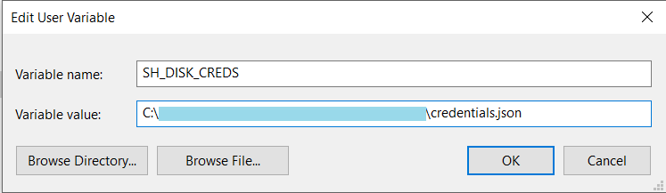
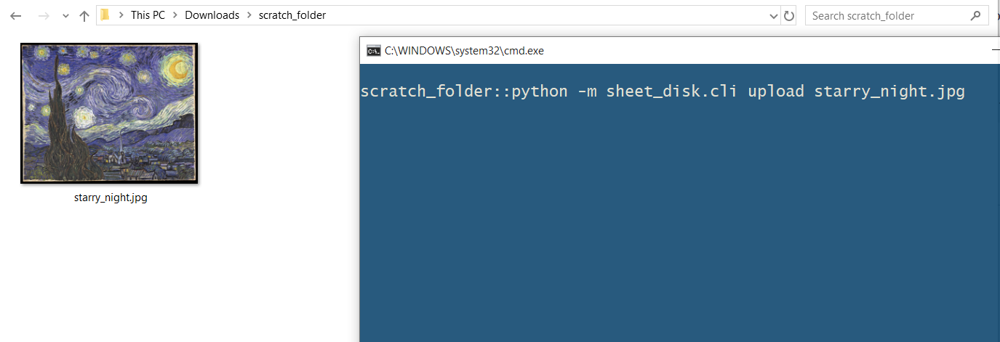
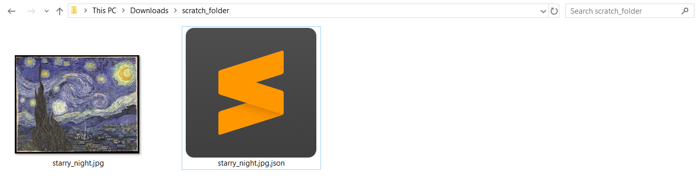
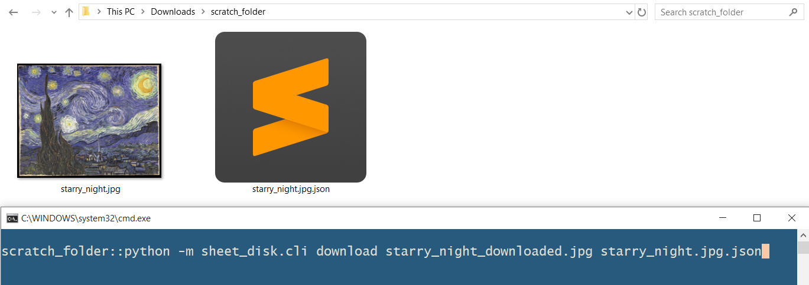
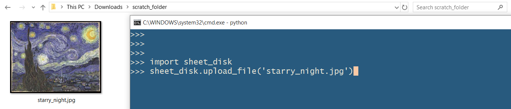
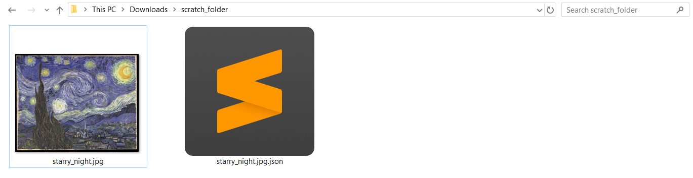
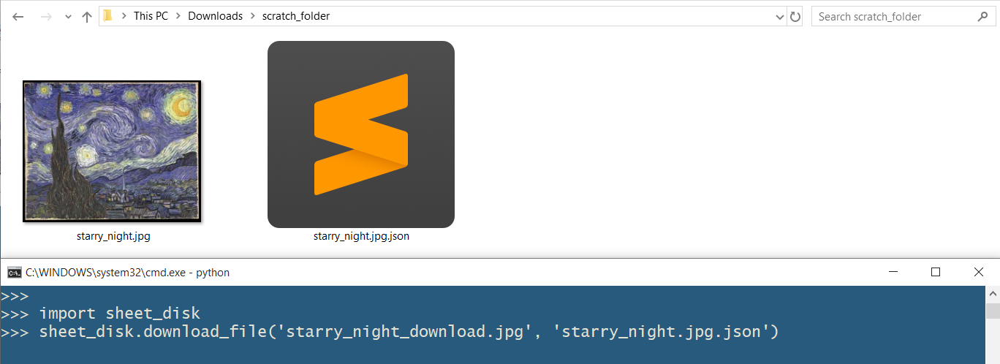
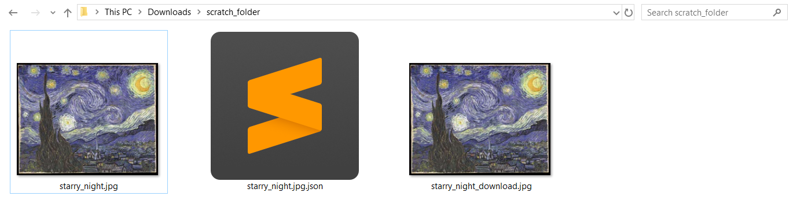

# Sheet Disk

Use Google Sheets as a storage device!

# What is it?

Encode your files into `base64` format and store them in a  Google Sheets spreadsheet in text format!

Google Sheets files don't count towards your Drive Storage, so we create these files without them taking up space on the Drive. So, essentially you can have your data be on google servers but take up 0 bytes.

**Note**: The spreadsheet files are created programmatically, and they are stored under the Service Account you get when you sign up for Google Sheet API credentials (See How to Install section), so you won't be able to see the files in your Google Drive.
You'll only be able to access these files through this program.

# How it works

Each cell can hold 50000 characters, that means each cell can easily hold 50kbytes of your data. But, we need to prepend the `'` character to each cell, so that `=`  doesn't get interpreted as a formula.

Current limit for each cell in the program is 49500 characters, but you could change that to 49998 for more storage.

The hard limit for cells in a Spreadsheet is 2 million cells, but when we fill the cells in such a  dense manner, we can only use about 1000 cells in one spreadsheet file. Hence, your file is broken down in chunks of 1000 * 49500 bytes and stored in separate spreadsheet files.

**Note**: There is a 33% overhead that comes with converting files to their `base64` representation.

# How to install (TODO)

* Prerequisites:

	This package makes use of `gspread`, which needs OAuth credentials to work. To get them, [Click here](https://gspread.readthedocs.io/en/latest/oauth2.html).

	After you download the OAuth credentials file, store it in a safe location. Copy it's path, and create an environment variable, named `SH_DISK_CREDS`.

	For example,

	

To install this package, run:

`pip install sheet_disk`

Requirements: 
* Python 3.6.7+ (May work on lower versions of 3.x, but hasn't been tested on that).
* Windows 10 (May work on Linux, MacOS, and older Windows but it's not been tested on them).

# How to use

## 1. Using as a Command Line Program

	
   * Uploading a file:
       
      `python -m sheet_disk.cli upload [path_to_file]`
      
      After uploading has finished, a JSON file will be created in your current directory. This file will help you retrieve your uploaded file from Google Sheets. 
      
      Note: **DON'T LOSE THIS JSON FILE. IF YOU LOSE THIS FILE, YOU CAN'T RETRIEVE YOUR UPLOADED FILE.**
      
      Currently, the created sheets files are made public by default, so that you can share your files with friends, by simply sending them the JSON file.
    
   * Downloading a file:
    
     `python -m sheet_disk.cli download [download_path.extension] [file_info.json]`
        
      Where,
        	
       * download_path.extension = Download location for the file
       * file_info.json = The json file containing the information about the uploaded file, you got when you uploaded the file
    
   * To see argument usage, use: 
    `python -m sheet_disk.cli -h`

## 2. Using in a program
	
   For using this package in a program, you can do the following:
    
    >>> import sheet_disk
	>>> sheet_disk.upload_file('My File Path.jpg')
	>>> sheet_disk.download_file('My downloaded file.jpg', 'My File Details.json')

    
 
# Sample Usage

* ## CLI:

	* ### Code:
	
		`python -m sheet_disk.cli upload starry_night.jpg`
        
        `python -m sheet_disk.cli download starry_night_download.jpg starry_night.jpg.json`

	* ### Uploading a file:
	
    	Before Uploading:

		

		After Uploading:
        
		

	* ### Downloading a file:

		Before Downloading:

		
        
        After Downloading:
        
		
* ## Program:

	* ### Code:
	
			import sheet_disk
    	    sheet_disk.upload_file('starry_night.jpg')
        	sheet_disk.download_file('starry_night_download.jpg', 'starry_night.jpg.json')

	* ### Uploading a file:
	 
       	Before Uploading:

		
        
        After Uploading:
        
        
    
	* ### Downloading a file:
	
    	Before Downloading:
        
    	
        
        After Downloading:
        
        

# Liability

I don't take any liability on the off chance that you are not able to retrieve your file from Sheets. 
Please take multiple backups of your files, in case you are not able to retrieve your files from Google Sheets.